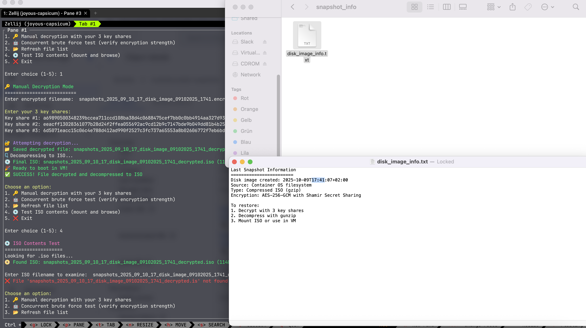

# Mobula - Encrypted Snapshot System

A secure, automated snapshot system that creates encrypted backups and optionally uploads them to OVH S3 Object Storage. The system uses Shamir's Secret Sharing for key management, ensuring that no single point of failure can compromise your encrypted data.

## Quick Start

### 1. Configuration Setup
```bash
# Copy the example configuration
cp .env.example .env

# Edit the configuration file
nano .env
```
Configure your settings (OVH S3 credentials, retention policy, etc.) before starting.

### 2. Build and Start
```bash
make up
```
This builds the Docker image and starts the container. The system will begin taking snapshots every 5 minutes.

### 3. Generate Encryption Keys
```bash
make generate
```
Generate encryption keys using Shamir's Secret Sharing. You'll receive key shares that must be stored securely and separately.

### 4. View Logs
```bash
make logs
```
Monitor the system's activity and snapshot creation in real-time.

## Makefile Commands

### Core Operations
- **`make build`** - Build the Docker image
- **`make up`** - Build and start the container (or restart if already exists)
- **`make down`** / **`make stop`** - Stop the container (preserves data)
- **`make logs`** - View real-time container logs (Ctrl+C to exit)

### Container Management
- **`make destroy`** - Stop and permanently remove the container (asks for confirmation)
- **`make clean`** - Remove both container and Docker image (calls destroy first)
- **`make shell`** - Get interactive shell access to the running container

### Key Management & Testing
- **`make generate`** - Generate new encryption keys and Shamir shares
- **`make test`** - Run comprehensive encryption tests
- **`make decrypt`** - Interactive snapshot decryption tool

### Utilities
- **`make snapshots`** - List current snapshot files
- **`make help`** - Show all available commands

## Container Lifecycle

### Starting Fresh
```bash
make up          # Creates and starts new container
make generate    # Generate encryption keys
make logs        # Monitor activity
```

### Daily Operations
```bash
make down        # Stop container (keeps data)
make up          # Restart container (same data)
make logs        # Check logs
```

### Complete Reset
```bash
make destroy     # Remove container (asks confirmation)
make clean       # Remove container + image
make up          # Start completely fresh
```

## Important Notes

### Data Persistence
- **`make down`** only **stops** the container - all keys, snapshots, and configuration are preserved
- **`make up`** will restart the existing container with all data intact
- **`make destroy`** permanently deletes everything - use with caution!

### Key Management
- Always run `make generate` after `make destroy` to create new encryption keys
- Store the generated key shares securely and separately
- The test file is automatically cleaned when new keys are generated

### Monitoring
- Use `make logs` to monitor snapshot creation and cloud uploads
- Snapshots are organized in `/app/snapshots/DD/MM/HH/` structure
- Failed operations are logged in red, successful ones in green

## Configuration (.env file)

Copy `.env.example` to `.env` and modify according to your needs:

```bash
cp .env.example .env
nano .env
```

**Important**: The `.env` file contains sensitive information and is excluded from git. Always use `.env.example` as your template.

### Shamir Secret Sharing Configuration
```bash
SHAMIR_TOTAL_SHARES=3    # Total number of key shares to generate
SHAMIR_THRESHOLD=3       # Minimum shares needed to decrypt
```

**Why Shamir's Secret Sharing?**
We use [HashiCorp Vault's Shamir implementation](https://github.com/hashicorp/vault/shamir) for cryptographic key splitting. This algorithm divides the master encryption key into multiple shares where:
- **Security**: No single share can decrypt data alone
- **Redundancy**: You can lose some shares and still recover data
- **Distributed Trust**: Different people/systems can hold different shares
- **Industry Standard**: Used by HashiCorp Vault for production security

### Encryption & Storage Paths
```bash
DISK_IMAGE_DIR=/app/disk_images      # Where encrypted disk images are stored
KEY_DIR=/app/keys                    # Directory for encryption keys
KEY_FILE=/app/keys/master.key        # Full path to master key file
TEST_FILE=/app/test_hello.encrypted  # Test file for encryption validation
```

### Data Retention
```bash
DAY_RETENTION=7    # Remove snapshots older than N days (0 = keep forever)
```

### OVH S3 Object Storage (Optional)
```bash
S3_ENABLED=true                                           # Enable cloud uploads
S3_ENDPOINT=https://s3.gra.io.cloud.ovh.net              # OVH S3 endpoint (change region if needed)
S3_REGION=gra                                            # OVH region (gra, rbx, sbg, etc.)
S3_ACCESS_KEY_ID=your-access-key-id                      # S3 access key
S3_SECRET_ACCESS_KEY=your-secret-access-key              # S3 secret key
S3_BUCKET_NAME=your-bucket-name                          # S3 bucket name
S3_BUCKET_PREFIX=backups                                 # Folder prefix in bucket
```

**How to get OVH S3 credentials:**
1. Log in to your OVH Control Panel
2. Go to "Public Cloud" > "Object Storage" > "S3 Users"
3. Create a new S3 user or use an existing one
4. Download the credentials (Access Key ID and Secret Access Key)
5. Create an S3 bucket in your desired region (e.g., GRA for Gravelines, France)
6. Use the appropriate endpoint for your region:
   - GRA (Gravelines): `https://s3.gra.io.cloud.ovh.net`
   - BHS (Beauharnois): `https://s3.bhs.io.cloud.ovh.net`
   - SBG (Strasbourg): `https://s3.sbg.io.cloud.ovh.net`
   - RBX (Roubaix): `https://s3.rbx.io.cloud.ovh.net`
   - WAW (Warsaw): `https://s3.waw.io.cloud.ovh.net`
   - DE (Frankfurt): `https://s3.de.io.cloud.ovh.net`
   - UK (London): `https://s3.uk.io.cloud.ovh.net`

### Cross-Platform Compatibility Settings

#### System Paths
```bash
TEMP_MOUNT_POINT=/tmp/disk_mount        # Temporary mount point for disk operations
TEMP_BOOT_MOUNT=/tmp/boot_mount         # Temporary mount for bootloader setup
TEMP_ISO_DIR=/tmp/iso_content           # Directory for ISO content preparation
TEMP_ISO_FILE=/tmp/temp.iso             # Temporary ISO file location
INFO_FILE_NAME=last_snapshot_info.txt   # Snapshot information file name
SNAPSHOT_INFO_DIR=snapshot_info         # Directory inside ISO for snapshot metadata
DISK_IMAGE_INFO_FILE=disk_image_info.txt # Info file inside ISO with creation details
```

#### System Tools Paths (OS-specific)
```bash
MKFS_EXT4_PATH=/sbin/mkfs.ext4                      # ext4 filesystem creation tool
GENISOIMAGE_PATH=genisoimage                        # ISO creation utility
ISOLINUX_LIB_PATH=/usr/lib/ISOLINUX                 # Isolinux bootloader files
SYSLINUX_LIB_PATH=/usr/lib/syslinux/modules/bios    # Syslinux modules
```

**Note**: These paths may vary between Linux distributions (Ubuntu, CentOS, Alpine, etc.). Modify them according to your system's package installation locations.

#### Filesystem Exclusions
```bash
EXCLUDE_PROC=/proc/*         # Virtual process information (not real files)
EXCLUDE_SYS=/sys/*           # System/kernel virtual filesystem
EXCLUDE_DEV=/dev/*           # Device files (recreated on boot)
EXCLUDE_TMP=/tmp/*           # Temporary files directory
EXCLUDE_VAR_TMP=/var/tmp/*   # Additional temporary files
EXCLUDE_RUN=/run/*           # Runtime data (PIDs, sockets)
EXCLUDE_MNT=/mnt/*           # Mount points for external drives
EXCLUDE_MEDIA=/media/*       # Removable media mount points
EXCLUDE_LOST_FOUND=/lost+found # Filesystem recovery directory
```

**Why exclude these directories?**
- **Virtual filesystems** (`/proc`, `/sys`, `/dev`) don't contain real files - they're generated by the kernel
- **Temporary directories** (`/tmp`, `/var/tmp`, `/run`) contain ephemeral data that shouldn't be backed up
- **Mount points** (`/mnt`, `/media`) may contain external drives or network shares
- **Recovery directories** (`/lost+found`) are used by filesystem repair tools
- Including them would create huge, unusable backups with virtual/temporary data

## Encryption Technology

### Why AES-GCM?
- **AES-256**: Industry-standard symmetric encryption
- **GCM Mode**: Provides both encryption and authentication
- **Tamper Detection**: Any modification to encrypted data is detected
- **Performance**: Fast encryption/decryption for large files

### Security Architecture
1. **Random Master Key**: 256-bit key generated with crypto/rand
2. **Shamir Splitting**: Master key split into configurable shares
3. **AES-GCM Encryption**: Snapshots encrypted with authenticated encryption
4. **Secure Storage**: Encrypted snapshots can be stored anywhere safely

## Encryption Testing

### test_encryption/ Folder
A standalone testing tool to verify your encryption strength and recover your snapshots:



#### Manual Decryption Test (Option 1)
1. Copy your `.encrypted` snapshot files to the `test_encryption/` folder
2. Run `cd test_encryption && go run main.go`
3. Choose **Option 1** - Manual decryption with your 3 key shares
4. Enter the filename of your encrypted snapshot
5. Enter your 3 key shares when prompted

**Result**: The tool will:
- Decrypt your snapshot using the 3 key shares
- Save the decrypted data as `filename_decrypted.iso.gz`
- Automatically decompress it to `filename_decrypted.iso`
- Create a bootable ISO ready for use in VMs

#### Accessing Your Backup Data
Once decrypted, you can extract and browse your backup:

```bash
# Extract ISO contents (recommended for macOS)
brew install p7zip
7z x filename_decrypted.iso -o./extracted_backup/

# Browse your backup files
ls -la ./extracted_backup/

# Check snapshot creation info
cat ./extracted_backup/snapshot_info/disk_image_info.txt
```

The `disk_image_info.txt` file contains:
- Exact timestamp when the snapshot was encrypted
- Source filesystem information
- Encryption method details
- Recovery instructions

#### Brute Force Security Test (Option 2)
- **Concurrent Attack Simulation**: Tries millions of random key combinations
- **Proves Uncrackability**: Demonstrates that your encryption is mathematically secure
- **Performance Metrics**: Shows attack rate and estimated time to crack (infinity)

#### Other Options
- **Option 3**: Refresh file list to see available encrypted snapshots
- **Option 4**: Test ISO contents and get mounting instructions
- **Option 5**: Exit the tool
